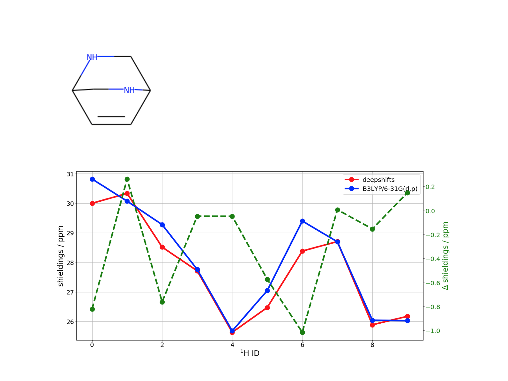

## Towards DFT quality chemical shifts using deep learning

**Deepshifts** is a ongoing research project that uses **Artificial Intelligence** to infer DFT-quality, conformation & environment dependent, chemical shieldings of organic molecules, based on a subset of the GDB-8 databaset (containing only H, C, N and O).

## Some preliminary results: DFT *vs* Deepshifts 1H shieldings 

### Single molecules

### water cluster

